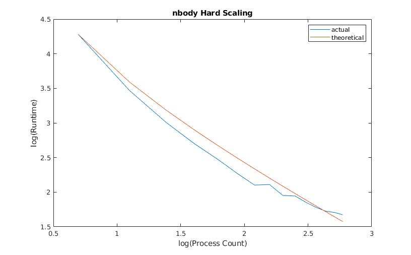
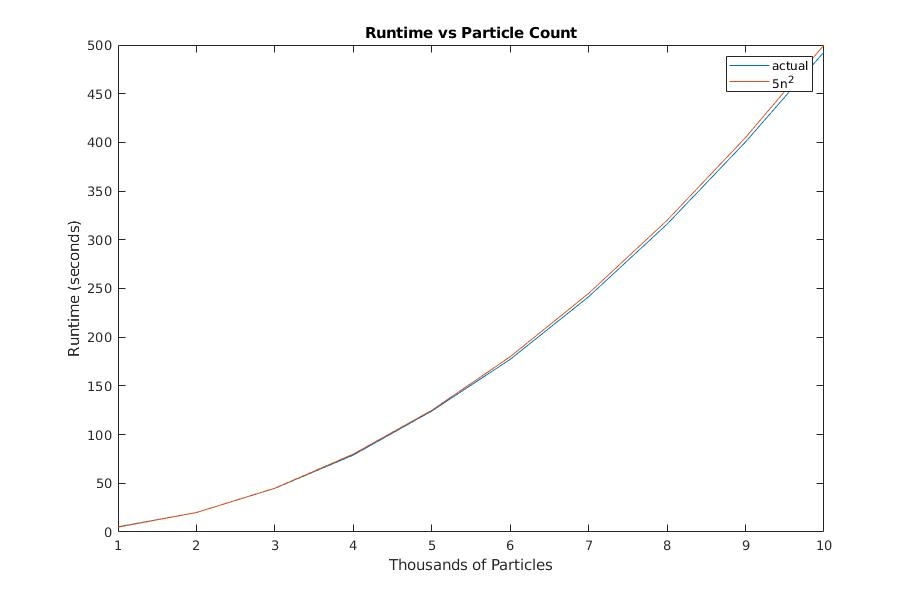

# HPC-Project-2
This is a minimally functional N-body gravitational simulator written by Ryan Collette.

## Building
Building the project requires CMake and MPI. To build the simulator call cmake on the project root directory then, in the same directory, call make. The output is a single executable file called nbody.

## Running
To use the simulator simply execute the nbody file using mpirun followed by any simulator arguments. In its current state a minimum of 2 processes are required.

The simulator arguments are:
1. (int) particle count
2. (float) time span
3. (float) step size
4. (float) G, gravitational coefficient
5. (float) framerate (0 for no output)
6. (int) blocks per proc (detailed below)

Ex: mpirun -n 4 nbody 1000 10.0 0.001 5.6 0 1

All arguments are optional, but must be supplied in order. To get details on each argument execute the program normally with the command "help."

Ex: ./nbody help

## Output
If the simulator is supplied a positive framerate it will output the state of the particle system as a sequence of csv formatted files. The files are created in the directory from which the program was executed. A designated directory for the results is therefore highly recommended.

The project also includes a basic matlab script proto/movie.m that compiles all the frames in its working directory into a .avi clip.

## Algorithm

In its current state the simulator fixes the mass of all particles as 1.0. The algorithm uses a brute force approach, which provides high accuracy but is hardly the most performant algorithm for gravitational N-body simulation. The algorithm is as follows:

for each integration step
	1. sum up the forces between all pairs of particles
	2. update the position and velocity of each particle

The magnitude of the force between particles $i$ and $j$ is given by the classical formula
$$F_{ij} = \frac{G m_i m_j}{r_{ij}^2},$$
where $G$ is the gravitational coefficient, $m_i, m_j$ are the masses of the respective particles, and $r_{ij}$ is the distance between them. The total force felt by particle $i$ is then
$$m_i G \sum_{j \ne i} \frac{m_j}{r_{ij}^2}.$$
We may directly compute the acceleration of particle $i$ as
$$a_i = G \sum_{j \ne i} \frac{m_j}{r_{ij}^2}$$
without directly involving the particle's mass.

Since $F_{ij}$ is unbounded particles can very easily incur problematic numerical error as they near each other. To compensate for this we enforce a minimum distance $\epsilon$ between particles, and the modified acceleration formula becomes
$$a_i = G \sum_{j \ne i} \frac{m_j}{(r_{ij} + \epsilon)^2}.$$

The acceleration for each particle is calculated using this formula and stored in array. Once all accelerations have been calculated the integration step is performed using the leapfrog / Verlet method, which for step size $h$ has iteration scheme:

$$v_{n+\frac{1}{2}} = v_n + \frac{h}{2} a_n$$
$$x_{n+1} = x_n + h v_{n+\frac{1}{2}}$$
$$v_{n+1} = v_{n+\frac{1}{2}} + \frac{h}{2} a_n.$$

## Parallelization

Despite the simplicity of the serialized simulator it proved quite tricky to parallelize. One consideration is to partition the domain of particles and allow each process to be responsible for some number of them, however this immediately leads to complications. If process A is responsible for particle $i,$ it must know about the force pairs between $i$ and _all_ other particles. Furthermore, any force pair it calculates between $i$ and a particle $j$ belonging to some other process B will be redundantly calculated unless it somehow shares the results. Thus the natural way to divide work is among _force pairs_, not particles. The parallel design implemented here attempts to divide the domain of force pairs among processes in a convenient, symmetric way.

The set of force pairs can be thought of as a 2D array $F$ where $F[i,j]$ is the force felt by particle $i$ due to particle $j$. Since $F$ satisfies
$$F[i,i] = 0,$$
$$F[i,j] = -F[j,i],$$
only $\frac{N}{2} - N$ force pair calculations are theoretically required for $N$ particles. Only one triangular region of the array needs to be filled in, and for simplicity we would like regions to have a uniform shape and size.

These considerations lead us to the following partition scheme:
* divide the array of particles into segments
* divide the array of force pairs into square blocks defined by a _row segment_ and a _column segment_
* queue the blocks as work units on multiple processes
* consider a block complete if its diagonal mirror is complete

Once an entire row of force blocks is competed the particles of that row are ready for the integration step, and the cycle can be completed again. Hence there are two types of jobs: computing force blocks and performing the integration step. Which processes perform which jobs? There are perhaps two obvious approaches:
1. All procs perform both types of jobs.
2. Each proc performs one type of job.

Option 1 is certainly harder to synchronize, since it leaves both acceleration and particle state data distributed across multiple processes. In the absence of a centralized control unit it also requires processes to coordinate jobs among themselves.

Option 2 can alleviate these drawbacks. But how many procs should perform each type of job, and how are jobs assigned? Since force pair calculation is an N^2 operation and time stepping is linear, it seems plausible that a single process can be responsible for scheduling and time stepping with little bottleneck.

This simulator implements option 2. A single process is responsible for scheduling force block calculations to multitude of worker threads, and performing the integration step on segments of particles as the necessary data arrives. In high level pseudocode the algorithms for the scheduler and worker threads are as follows:

**Scheduler:**
```
while stepping:
	receive block accelerations from worker procs
	add block accelerations to total accelerations of row and column particles

	if block row complete:
		perform integration step for row particles
		flag all blocks in row for update

	while worker proc available:
		send row particles to worker proc
		send col particles to worker proc
```

**Worker:**
```
while not terminated
	receive row particles from scheduler proc
	receive col particles from scheduler proc
	compute block accelerations
	send block accelerations to scheduler proc
```

Many small details of the synchronization mechanism are omitted and are perhaps best presented by the code itself. One detail worth mentioning is the diagonal blocks, which in theory only need their upper (or lower) triangular regions computed. For simplicity we have workers process these blocks in the same way as the others. The results are not affected, and the overhead is likely not significant given that the number of duplicated force pairs is relatively small compared to the total number.

## Results

The scaling of this algorithm is by far the best I have personally achieved in this course, and closely agrees with theoretical scaling with up to 16 processes. The figures below show performance results as well tests of how the problem scales with both particle count and time span. As expected, runtime is O(N^2) in particle count and O(N) in time span.

One interesting finding is that increasing the number of blocks relative to processor count had no discernible effect on performance. Clearly we would not expect this in the limits, since if there were fewer blocks than processes some processes would always be idle, and if every force pair constituted its own block the overhead from process waiting and messaging would become dominant.


*Excellent scaling up to 16 processes on lolcat with 1000 particles for 1 second.*


*Since we are using the brute force approach and calculating the force interactions among all particles the problem is N^2 in number of particles.*


*Since the amount of computation is the same for each time step the problem is linear in time.*
